# Plan: Schema bazei de date SQLite pentru aplicația AI3

## 1. Contexte și constrângeri

- **Tehnologie**: SQLite, schema normalizată (3NF/BCNF), denumiri în engleză (standard industrie).
- **Surse**: cerințele tale, diagramele atașate, [Statutul AI3](https://ai3.ro/Statut_AI3.pdf) (Art. 6–13, 15–20).
- **Module**: **user/profil/RBAC**, **membri** (CTI), **meetups**, **dojo**, **adunare generală**, **Festival difffusion**.
- **Migrații**: `db/0001_initial_schema.sql` (core), `db/0002_festival_difffusion.sql` (festival + blog).

---

## 2. Principii de modelare

- **Profil** = entitate centrală pentru persoane (membri, mentori, tutori, ninjas, prezentatori, simpatizanți, invitați). Nu toate persoanele au cont în platformă → **User** opțional 1:1 cu Profile.
- **Membri**: **Class Table Inheritance (CTI)** — tipul de membership ca sum type, fără legături către tabele externe de lookup. Tabel de bază **members**; subclase: **aspiring_members** (Aspiring), **full_members** (Full FullMember) cu câmp **full_member_kind** = `'founder'` | `'honorary'` | `'regular'` (echivalent `data FullMember = Founder | Honorary | Regular`; `data Member = Aspiring | Full FullMember`). Fiecare membru apare în exact una din subclase. Drept de vot = prezență în **full_members** (pentru AG). Cotizația în **membership_fees** doar pentru `full_member_kind = 'regular'`. Fără istoric în timp (fără `left_at`).
- **Meetups**: un meetup = o întâlnire cu **dată, oră și locație** (o singură sursă: doar în `meetups`); fie are un atelier, fie un anti-atelier (alternanță săptămânală). Locația și ora nu se redau în tabelele de atelier/anti-atelier.
- **Dojo**: scopul este **anunțarea** sesiunilor (dată, oră, locație, tematică, **mentor responsabil** care ține sesiunea). Nu se face tracking de prezență. **Ninjas** = copiii participanți; nu pot semna documente (minori). **Tutori** = adulți responsabili care asigură tutelajul și **semnează acordurile** în numele copiilor. Ninja are legătură la **profil** și la **tutor** (`tutor_id`); singura informație specifică ninja este **useful_info**. Acordurile: documente cu nume unic; mentorii/tutorii semnează (legătură la document + timestamp).
- **RBAC**: roluri și legături user–rol pentru acces per modul (username/parolă doar la User).
- **Festival difffusion**: ediții anuale cu temă și branding complet (logo, hero image, descrieri, imagini secundare/accent, paletă culori, after-video). Galerie foto per ediție. Blog cu tag-uri (fiecare ediție are un tag). Secțiuni specifice temei; activități aparțin secțiunilor (legătura la ediție doar prin section_id). Program = locație festival + activitate + oră. Locații festival cu coordinator (voluntar). Staff = membri AI3 + voluntari (doar profile_id, fără user_id). Invitați cu profile_id, roluri enum. Sponsori cu tip/nivel enum, locații comerciale de discount separate de locațiile festival. Bilete gratuite cu titular = profil, max 5 invitați, răscumpărări la locațiile de discount (limitate de redeem_max). Fișiere uploadate: doar file name, URL-uri construite de aplicație.

---

## 3. Schema tabelelor (SQLite)

### 3.1 Utilizatori și profil

| Tabel          | Descriere                                                                                                                                                                                               |
| -------------- | ------------------------------------------------------------------------------------------------------------------------------------------------------------------------------------------------------- |
| **profiles**   | Persoană: `id` PK, `name` TEXT NOT NULL, `email` TEXT, `phone` TEXT, `birth_date` TEXT (dată), `created_at`, `updated_at` (datetime TEXT). Email/telefon pot fi NULL. |
| **users**      | Cont platformă: `id` PK, `profile_id` INTEGER UNIQUE NOT NULL FK→profiles, `username` TEXT UNIQUE NOT NULL, `password_hash` TEXT NOT NULL, `created_at`, `updated_at`. Un profil are cel mult un user.  |
| **roles**      | Roluri RBAC: `id` PK, `name` TEXT UNIQUE NOT NULL (ex. admin, member, mentor).                                                                                                                          |
| **user_roles** | Legătură M:N: `user_id` FK→users, `role_id` FK→roles, PK (user_id, role_id).                                                                                                                            |

### 3.2 Membri (Class Table Inheritance)

Echivalent tipuri de date sum: `data FullMember = Founder | Honorary | Regular`; `data Member = Aspiring | Full FullMember`. Fără tabele externe de lookup; subtipul este dat de prezența în una din tabelele-subclasă.

| Tabel                | Descriere                                                                                                                                                                                                                                                                                                       |
| -------------------- | --------------------------------------------------------------------------------------------------------------------------------------------------------------------------------------------------------------------------------------------------------------------------------------------------------------- |
| **members**          | Tabel de bază: `id` PK, `profile_id` INTEGER UNIQUE NOT NULL FK→profiles, `joined_at` TEXT NOT NULL (dată), `created_at`, `updated_at` (datetime TEXT). Fără `left_at`. Fiecare rând este fie Aspiring fie Full (constraint: exact una din subclase).                                                                  |
| **aspiring_members** | Subclasă (Aspiring): `member_id` PK FK→members (1:1). Prezența rândului = membru aspirant (fără drept de vot).                                                                                                                                                                                                  |
| **full_members**     | Subclasă (Full FullMember): `member_id` PK FK→members (1:1), `full_member_kind` TEXT NOT NULL CHECK(full_member_kind IN ('founder','honorary','regular')). Prezența rândului = membru cu drept de vot; `full_member_kind` = variantă (Founder / Honorary / Regular). Cotizația nu se solicită founder/honorary. |
| **membership_fees**  | Cotizație anuală: `id` PK, `member_id` FK→members, `year` INTEGER NOT NULL, `amount` NUMERIC, `status` TEXT NOT NULL. UNIQUE(member_id, year). Doar pentru membri care au rând în **full_members** cu `full_member_kind = 'regular'` (trigger sau aplicație).                                                   |

**Constraint**: fiecare `members.id` apare în exact una din `aspiring_members` sau `full_members` (trigger sau aplicație). Drept de vot în AG: membru are rând în **full_members**.

### 3.3 Meetups (întâlniri săptămânale)

**Locația și ora** sunt doar în `meetups` (fără duplicare în atelier/anti-atelier).

| Tabel                     | Descriere                                                                                                                                                                                                                                                                                                         |
| ------------------------- | ----------------------------------------------------------------------------------------------------------------------------------------------------------------------------------------------------------------------------------------------------------------------------------------------------------------- |
| **meetups**               | Întâlnire: `id` PK, `starts_at` TEXT NOT NULL (datetime; dată/oră extrase în interogări cu `date(starts_at)`, `time(starts_at)`), `location` TEXT NOT NULL, `created_at`, `updated_at`. Sursa unică pentru moment și locație.                                                                                        |
| **meetup_workshops**      | Atelier: `id` PK, `meetup_id` INTEGER UNIQUE NOT NULL FK→meetups (1:1), `title` TEXT NOT NULL, `presenter_id` INTEGER NOT NULL FK→profiles, `theme` TEXT NOT NULL CHECK(theme IN ('demo_your_stack','fup_nights','meet_the_business')), `created_at`, `updated_at`. Fără location/starts_at — se iau din meetups. |
| **meetup_anti_workshops** | Anti-atelier: `id` PK, `meetup_id` INTEGER UNIQUE NOT NULL FK→meetups (1:1), `agenda` TEXT, `created_at`, `updated_at`. Fără location/starts_at — se iau din meetups.                                                                                                                                             |

Tematică atelier = enum prin CHECK (suficient, fără tabel `workshop_themes`). Fiecare meetup are fie un rând în `meetup_workshops`, fie unul în `meetup_anti_workshops` (constraint aplicativ).

### 3.4 CoderDojo

Scop: **anunțarea** sesiunilor (tematică + mentor responsabil care ține sesiunea). Fără tracking de prezență. **Ninjas** = copiii participanți; nu semnează (minori). **Tutori** = adulți responsabili care semnează acordurile. Ninja: legătură la profil, doar **useful_info** specific.

| Tabel                           | Descriere                                                                                                                                                                                                                                                                                                                                                                                                                            |
| ------------------------------- | ------------------------------------------------------------------------------------------------------------------------------------------------------------------------------------------------------------------------------------------------------------------------------------------------------------------------------------------------------------------------------------------------------------------------------------ |
| **dojo_sessions**               | Sesiune anunțată: `id` PK, `starts_at` TEXT NOT NULL (datetime; dată/oră cu `date(starts_at)`, `time(starts_at)`), `location` TEXT NOT NULL, `theme` TEXT, `mentor_id` INTEGER NOT NULL FK→dojo_mentors, `created_at`, `updated_at`.                                                                                                                                                                                             |
| **dojo_mentors**                | Mentor: `id` PK, `profile_id` INTEGER NOT NULL FK→profiles, `description` TEXT, `created_at`, `updated_at`.                                                                                                                                                                                                                                                                                                                          |
| **dojo_tutors**                 | Tutor (adult responsabil) pentru ninja: `id` PK, `profile_id` INTEGER NOT NULL FK→profiles, `created_at`, `updated_at`. Legătura ninja → tutor prin `dojo_ninjas.tutor_id`.                                                                                                                                                                                                                                                       |
| **dojo_ninjas**                 | Copil (ninja) participant la dojo: `id` PK, `profile_id` INTEGER NOT NULL FK→profiles, `tutor_id` INTEGER NOT NULL FK→dojo_tutors, `useful_info` TEXT, `created_at`, `updated_at`. Nu duplicăm date din profil; doar **useful_info** e specific. Ninjas nu semnează (minori); tutorii (adulți responsabili) semnează acordurile. |
| **agreement_documents**         | Documente de acord cu **nume unic** (pentru generare link): `id` PK, `name` TEXT UNIQUE NOT NULL (ex. "Mentor training - working with children", "Tutor privacy and rules").                                                                                                                                                                                                                                                         |
| **mentor_agreement_signatures** | Acord: `id` PK, `mentor_id` FK→dojo_mentors, `document_id` FK→agreement_documents, `signed_at` TEXT NOT NULL (datetime), `created_at`. UNIQUE(mentor_id, document_id).                                                                                                                                                                                                                                                              |
| **tutor_agreement_signatures**  | Acord: `id` PK, `tutor_id` FK→dojo_tutors, `document_id` FK→agreement_documents, `signed_at` TEXT NOT NULL (datetime), `created_at`. UNIQUE(tutor_id, document_id).                                                                                                                                                                                                                                                                  |

### 3.5 Adunare Generală (extensie / fază ulterioară)

Drept de vot: doar membrii care au rând în **full_members** (aspiranții nu votează).

| Tabel                          | Descriere                                                                                                                                                                                                                            |
| ------------------------------ | ------------------------------------------------------------------------------------------------------------------------------------------------------------------------------------------------------------------------------------ |
| **general_assemblies**         | `id` PK, `year` INTEGER NOT NULL, `announced_at` TEXT (datetime), `held_at` TEXT (datetime), `location` TEXT, `min_quorum` INTEGER, `activity_report_document_id`, `minutes_document_id`, `created_at`, `updated_at`. Pentru dată/oră: `date(...)`, `time(...)` în interogări. |
| **general_assembly_attendees** | `assembly_id` FK→general_assemblies, `member_id` FK→members, `attended` INTEGER, PK (assembly_id, member_id). La vot: filtrare după existența în **full_members** (JOIN full_members ON member_id).                                  |

### 3.6 Festival difffusion (migrare `0002`)

Convenții specifice: coloanele `*_file` stochează doar numele fișierului (unic per tabel), nu URL complet. Enums fixe = CHECK constraints (fără tabele lookup).

#### 3.6.1 Ediții, branding și blog

| Tabel | Descriere |
| --- | --- |
| **festival_editions** | `id` PK, `year` INTEGER NOT NULL UNIQUE, `title` TEXT, `theme` TEXT, `custom_logo_file` TEXT, `hero_image_file` TEXT, `short_description` TEXT, `long_description` TEXT, `secondary_image_file` TEXT, `accent_image_file` TEXT, `main_color` TEXT, `secondary_color` TEXT, `accent_color` TEXT, `after_video_file` TEXT, `blog_tag_id` FK→blog_tags NULL, `created_at`, `updated_at`. |
| **festival_edition_gallery_photos** | `id` PK, `edition_id` FK, `photo_file` TEXT NOT NULL UNIQUE, `caption` TEXT, `sort_order` INTEGER, `created_at`, `updated_at`. |
| **blog_tags** | `id` PK, `name` TEXT UNIQUE NOT NULL. |
| **blog_posts** | `id` PK, `title` TEXT NOT NULL, `slug` TEXT UNIQUE, `summary` TEXT, `body` TEXT, `published_at` TEXT NULL, `created_at`, `updated_at`. |
| **blog_post_tags** | `post_id` FK→blog_posts, `tag_id` FK→blog_tags, PK(post_id, tag_id). |

#### 3.6.2 Secțiuni și activități

| Tabel | Descriere |
| --- | --- |
| **festival_sections** | `id` PK, `edition_id` FK NOT NULL, `name` TEXT NOT NULL, `created_at`, `updated_at`. |
| **festival_activities** | `id` PK, `section_id` FK NOT NULL, `title` TEXT, `description` TEXT, `activity_type` TEXT NOT NULL CHECK(...), `audience` TEXT NOT NULL CHECK(...), `created_at`, `updated_at`. |

#### 3.6.3 Locații festival și staff

| Tabel | Descriere |
| --- | --- |
| **festival_locations** | `id` PK, `edition_id` FK, `name` TEXT NOT NULL, `address` TEXT, `description` TEXT, `coordinator_id` FK→festival_volunteers NULL, `created_at`, `updated_at`. |
| **festival_volunteers** | `id` PK, `edition_id` FK, `profile_id` FK→profiles NOT NULL, `created_at`, `updated_at`. UNIQUE(edition_id, profile_id). |
| **festival_staff_members** | `edition_id` FK, `member_id` FK→members, PK(edition_id, member_id). |

#### 3.6.4 Invitați

| Tabel | Descriere |
| --- | --- |
| **festival_guests** | `id` PK, `edition_id` FK, `profile_id` FK→profiles NOT NULL, `created_at`, `updated_at`. |
| **festival_guest_roles** | `guest_id` FK, `role` TEXT NOT NULL CHECK(role IN ('speaker','workshop_org','artist','other')), PK(guest_id, role). |

#### 3.6.5 Program

| Tabel | Descriere |
| --- | --- |
| **festival_program** | `id` PK, `edition_id` FK, `location_id` FK→festival_locations, `activity_id` FK→festival_activities, `starts_at` TEXT NOT NULL, `ends_at` TEXT NULL, `created_at`, `updated_at`. |
| **festival_program_presenters** | `program_id` FK, `guest_id` FK→festival_guests, PK(program_id, guest_id). |

#### 3.6.6 Sponsori și locații discount

| Tabel | Descriere |
| --- | --- |
| **festival_sponsors** | `id` PK, `edition_id` FK, `name` TEXT NOT NULL, `sponsorship_type` TEXT NOT NULL CHECK(... IN ('media','institution','catering','publishing','other')), `sponsorship_level` TEXT NOT NULL CHECK(... IN ('whisperer','charmer','loudspeaker','difffusion_voice')), `logo_file` TEXT, `website` TEXT, `created_at`, `updated_at`. |
| **festival_sponsor_discount_locations** | `id` PK, `sponsor_id` FK NOT NULL, `name` TEXT NOT NULL, `address` TEXT, `discount_percent` INTEGER NOT NULL CHECK(BETWEEN 1 AND 100), `redeem_max` INTEGER NOT NULL CHECK(>= 1), `created_at`, `updated_at`. |

#### 3.6.7 Bilete și răscumpărări

| Tabel | Descriere |
| --- | --- |
| **festival_tickets** | `id` PK, `edition_id` FK, `holder_profile_id` FK→profiles NOT NULL, `code` TEXT NOT NULL, `guest_count` INTEGER NOT NULL DEFAULT 0 CHECK(BETWEEN 0 AND 5), `created_at`, `updated_at`. UNIQUE(edition_id, code). |
| **festival_discount_redeemings** | `id` PK, `ticket_id` FK NOT NULL, `discount_location_id` FK NOT NULL, `redeemed_at` TEXT NOT NULL. UNIQUE(ticket_id, discount_location_id). Trigger: count per discount_location_id nu poate depăși redeem_max. |

---

## 4. Diagramă Entity-Relationship

Diagrama ER arată tabelele, câmpurile și cardinalitățile. Simboluri: `||--o|` = 1 la 0..1, `||--o{` = 1 la N. Dacă diagrama Mermaid nu se renderează în preview, folosiți **tabelul de câmpuri și cardinalități** de mai jos.

```mermaid
erDiagram
  PROFILES ||--o| USERS : "1-0..1"
  PROFILES ||--o| MEMBERS : "1-0..1"
  PROFILES ||--o{ MEETUP_WORKSHOPS : "1-N"
  PROFILES ||--o| DOJO_MENTORS : "1-0..1"
  PROFILES ||--o| DOJO_TUTORS : "1-0..1"
  PROFILES ||--o| DOJO_NINJAS : "1-0..1"
  PROFILES ||--o{ FESTIVAL_VOLUNTEERS : "1-N"
  PROFILES ||--o{ FESTIVAL_GUESTS : "1-N"
  PROFILES ||--o{ FESTIVAL_TICKETS : "1-N"
  USERS ||--o{ USER_ROLES : "1-N"
  ROLES ||--o{ USER_ROLES : "1-N"
  MEMBERS ||--o| ASPIRING_MEMBERS : "1-0..1"
  MEMBERS ||--o| FULL_MEMBERS : "1-0..1"
  MEMBERS ||--o{ MEMBERSHIP_FEES : "1-N"
  MEMBERS ||--o{ FESTIVAL_STAFF_MEMBERS : "1-N"
  MEMBERS ||--o{ GA_ATTENDEES : "1-N"
  MEETUPS ||--o| MEETUP_WORKSHOPS : "1-0..1"
  MEETUPS ||--o| MEETUP_ANTI_WORKSHOPS : "1-0..1"
  DOJO_MENTORS ||--o{ DOJO_SESSIONS : "1-N"
  DOJO_TUTORS ||--o{ DOJO_NINJAS : "1-N"
  AGREEMENT_DOCS ||--o{ MENTOR_SIGS : "1-N"
  AGREEMENT_DOCS ||--o{ TUTOR_SIGS : "1-N"
  DOJO_MENTORS ||--o{ MENTOR_SIGS : "1-N"
  DOJO_TUTORS ||--o{ TUTOR_SIGS : "1-N"
  GENERAL_ASSEMBLIES ||--o{ GA_ATTENDEES : "1-N"
  FESTIVAL_EDITIONS ||--o{ FESTIVAL_SECTIONS : "1-N"
  FESTIVAL_EDITIONS ||--o{ FESTIVAL_EDITION_GALLERY_PHOTOS : "1-N"
  FESTIVAL_EDITIONS ||--o| BLOG_TAGS : "1-0..1"
  FESTIVAL_EDITIONS ||--o{ FESTIVAL_LOCATIONS : "1-N"
  FESTIVAL_EDITIONS ||--o{ FESTIVAL_GUESTS : "1-N"
  FESTIVAL_EDITIONS ||--o{ FESTIVAL_VOLUNTEERS : "1-N"
  FESTIVAL_EDITIONS ||--o{ FESTIVAL_TICKETS : "1-N"
  FESTIVAL_EDITIONS ||--o{ FESTIVAL_PROGRAM : "1-N"
  FESTIVAL_EDITIONS ||--o{ FESTIVAL_SPONSORS : "1-N"
  FESTIVAL_EDITIONS ||--o{ FESTIVAL_STAFF_MEMBERS : "1-N"
  FESTIVAL_SECTIONS ||--o{ FESTIVAL_ACTIVITIES : "1-N"
  BLOG_TAGS ||--o{ BLOG_POST_TAGS : "1-N"
  BLOG_POSTS ||--o{ BLOG_POST_TAGS : "1-N"
  FESTIVAL_VOLUNTEERS ||--o| FESTIVAL_LOCATIONS : "1-0..1"
  FESTIVAL_LOCATIONS ||--o{ FESTIVAL_PROGRAM : "1-N"
  FESTIVAL_ACTIVITIES ||--o{ FESTIVAL_PROGRAM : "1-N"
  FESTIVAL_PROGRAM ||--o{ FESTIVAL_PROGRAM_PRESENTERS : "1-N"
  FESTIVAL_GUESTS ||--o{ FESTIVAL_PROGRAM_PRESENTERS : "1-N"
  FESTIVAL_GUESTS ||--o{ FESTIVAL_GUEST_ROLES : "1-N"
  FESTIVAL_SPONSORS ||--o{ FESTIVAL_SPONSOR_DISCOUNT_LOCS : "1-N"
  FESTIVAL_TICKETS ||--o{ FESTIVAL_DISCOUNT_REDEEMINGS : "1-N"
  FESTIVAL_SPONSOR_DISCOUNT_LOCS ||--o{ FESTIVAL_DISCOUNT_REDEEMINGS : "1-N"
  PROFILES {
    int id PK
    string name
    string email
    string phone
    text birth_date
    text created_at
    text updated_at
  }
  USERS {
    int id PK
    int profile_id FK
    string username
    string password_hash
    text created_at
    text updated_at
  }
  ROLES {
    int id PK
    string name
  }
  USER_ROLES {
    int user_id FK
    int role_id FK
  }
  MEMBERS {
    int id PK
    int profile_id FK
    text joined_at
    text created_at
    text updated_at
  }
  ASPIRING_MEMBERS {
    int member_id PK
  }
  FULL_MEMBERS {
    int member_id PK
    string full_member_kind
  }
  MEMBERSHIP_FEES {
    int id PK
    int member_id FK
    int year
    numeric amount
    string status
  }
  MEETUPS {
    int id PK
    text starts_at
    string location
  }
  MEETUP_WORKSHOPS {
    int id PK
    int meetup_id FK
    string title
    int presenter_id FK
    string theme
  }
  MEETUP_ANTI_WORKSHOPS {
    int id PK
    int meetup_id FK
    string agenda
  }
  DOJO_SESSIONS {
    int id PK
    text starts_at
    string location
    string theme
    int mentor_id FK
  }
  DOJO_MENTORS {
    int id PK
    int profile_id FK
    string description
  }
  DOJO_TUTORS {
    int id PK
    int profile_id FK
  }
  DOJO_NINJAS {
    int id PK
    int profile_id FK
    int tutor_id FK
    text useful_info
  }
  AGREEMENT_DOCS {
    int id PK
    string name
  }
  MENTOR_SIGS {
    int id PK
    int mentor_id FK
    int document_id FK
    text signed_at
  }
  TUTOR_SIGS {
    int id PK
    int tutor_id FK
    int document_id FK
    text signed_at
  }
  GENERAL_ASSEMBLIES {
    int id PK
    int year
    text announced_at
    text held_at
    string location
  }
  GA_ATTENDEES {
    int assembly_id FK
    int member_id FK
  }
  FESTIVAL_EDITIONS {
    int id PK
    int year
    string title
    string theme
    string custom_logo_file
    string hero_image_file
    text short_description
    text long_description
    string secondary_image_file
    string accent_image_file
    string main_color
    string secondary_color
    string accent_color
    string after_video_file
    int blog_tag_id FK
    text created_at
    text updated_at
  }
  FESTIVAL_EDITION_GALLERY_PHOTOS {
    int id PK
    int edition_id FK
    string photo_file
    text caption
    int sort_order
    text created_at
    text updated_at
  }
  BLOG_TAGS {
    int id PK
    string name
  }
  BLOG_POSTS {
    int id PK
    string title
    string slug
    text summary
    text body
    text published_at
    text created_at
    text updated_at
  }
  BLOG_POST_TAGS {
    int post_id FK
    int tag_id FK
  }
  FESTIVAL_SECTIONS {
    int id PK
    int edition_id FK
    string name
    text created_at
    text updated_at
  }
  FESTIVAL_ACTIVITIES {
    int id PK
    int section_id FK
    string title
    text description
    string activity_type
    string audience
    text created_at
    text updated_at
  }
  FESTIVAL_LOCATIONS {
    int id PK
    int edition_id FK
    string name
    string address
    text description
    int coordinator_id FK
    text created_at
    text updated_at
  }
  FESTIVAL_VOLUNTEERS {
    int id PK
    int edition_id FK
    int profile_id FK
    text created_at
    text updated_at
  }
  FESTIVAL_STAFF_MEMBERS {
    int edition_id FK
    int member_id FK
  }
  FESTIVAL_GUESTS {
    int id PK
    int edition_id FK
    int profile_id FK
    text created_at
    text updated_at
  }
  FESTIVAL_GUEST_ROLES {
    int guest_id FK
    string role
  }
  FESTIVAL_PROGRAM {
    int id PK
    int edition_id FK
    int location_id FK
    int activity_id FK
    text starts_at
    text ends_at
    text created_at
    text updated_at
  }
  FESTIVAL_PROGRAM_PRESENTERS {
    int program_id FK
    int guest_id FK
  }
  FESTIVAL_SPONSORS {
    int id PK
    int edition_id FK
    string name
    string sponsorship_type
    string sponsorship_level
    string logo_file
    string website
    text created_at
    text updated_at
  }
  FESTIVAL_SPONSOR_DISCOUNT_LOCS {
    int id PK
    int sponsor_id FK
    string name
    string address
    int discount_percent
    int redeem_max
    text created_at
    text updated_at
  }
  FESTIVAL_TICKETS {
    int id PK
    int edition_id FK
    int holder_profile_id FK
    string code
    int guest_count
    text created_at
    text updated_at
  }
  FESTIVAL_DISCOUNT_REDEEMINGS {
    int id PK
    int ticket_id FK
    int discount_location_id FK
    text redeemed_at
  }
```

**Tabel de câmpuri și cardinalități** (referință completă dacă diagrama Mermaid nu se afișează):

| Tabel | Câmpuri | Cardinalitate relații |
| --- | --- | --- |
| **profiles** | id PK, name, email, phone, birth_date, created_at, updated_at | — |
| **users** | id PK, profile_id FK UNIQUE, username UNIQUE, password_hash, created_at, updated_at | profile 1→0..1 user |
| **roles** | id PK, name UNIQUE | — |
| **user_roles** | user_id FK, role_id FK — PK compus | user 1→N, role 1→N |
| **members** | id PK, profile_id FK UNIQUE, joined_at, created_at, updated_at (CTI base) | profile 1→0..1 |
| **aspiring_members** | member_id PK FK→members (1:1) — subclasă Aspiring | members 1→0..1 |
| **full_members** | member_id PK FK→members (1:1), full_member_kind CHECK — subclasă Full | members 1→0..1 |
| **membership_fees** | id PK, member_id FK, year, amount, status — UNIQUE(member_id, year) | members 1→N (doar regular) |
| **meetups** | id PK, starts_at, location | — |
| **meetup_workshops** | id PK, meetup_id FK UNIQUE, title, presenter_id FK, theme CHECK | meetup 1→0..1; profile 1→N |
| **meetup_anti_workshops** | id PK, meetup_id FK UNIQUE, agenda | meetup 1→0..1 |
| **dojo_sessions** | id PK, starts_at, location, theme, mentor_id FK | dojo_mentors 1→N |
| **dojo_mentors** | id PK, profile_id FK, description | profile 1→0..1 |
| **dojo_tutors** | id PK, profile_id FK | profile 1→0..1 |
| **dojo_ninjas** | id PK, profile_id FK, tutor_id FK, useful_info | profile 1→N; dojo_tutors 1→N |
| **agreement_documents** | id PK, name UNIQUE | 1→N mentor_sigs, 1→N tutor_sigs |
| **mentor_agreement_signatures** | id PK, mentor_id FK, document_id FK, signed_at | dojo_mentors 1→N; agreement_docs 1→N |
| **tutor_agreement_signatures** | id PK, tutor_id FK, document_id FK, signed_at | dojo_tutors 1→N; agreement_docs 1→N |
| **general_assemblies** | id PK, year, announced_at, held_at, location | — |
| **general_assembly_attendees** | assembly_id FK, member_id FK — PK compus | assembly 1→N; members 1→N |
| **blog_tags** | id PK, name UNIQUE | — |
| **blog_posts** | id PK, title, slug UNIQUE, summary, body, published_at | — |
| **blog_post_tags** | post_id FK, tag_id FK — PK compus | post 1→N; tag 1→N |
| **festival_editions** | id PK, year UNIQUE, title, theme, branding files/colors, after_video_file, blog_tag_id FK | blog_tags 1→0..1 |
| **festival_edition_gallery_photos** | id PK, edition_id FK, photo_file UNIQUE, caption, sort_order | edition 1→N |
| **festival_sections** | id PK, edition_id FK, name | edition 1→N |
| **festival_activities** | id PK, section_id FK, title, description, activity_type CHECK, audience CHECK | section 1→N |
| **festival_locations** | id PK, edition_id FK, name, address, description, coordinator_id FK | edition 1→N; volunteer 1→0..1 |
| **festival_volunteers** | id PK, edition_id FK, profile_id FK — UNIQUE(edition_id, profile_id) | edition 1→N; profile 1→N |
| **festival_staff_members** | edition_id FK, member_id FK — PK compus | edition 1→N; members 1→N |
| **festival_guests** | id PK, edition_id FK, profile_id FK | edition 1→N; profile 1→N |
| **festival_guest_roles** | guest_id FK, role CHECK — PK compus | guest 1→N |
| **festival_program** | id PK, edition_id FK, location_id FK, activity_id FK, starts_at, ends_at | edition 1→N; location 1→N; activity 1→N |
| **festival_program_presenters** | program_id FK, guest_id FK — PK compus | program 1→N; guest 1→N |
| **festival_sponsors** | id PK, edition_id FK, name, sponsorship_type CHECK, sponsorship_level CHECK, logo_file, website | edition 1→N |
| **festival_sponsor_discount_locations** | id PK, sponsor_id FK, name, address, discount_percent CHECK, redeem_max CHECK | sponsor 1→N |
| **festival_tickets** | id PK, edition_id FK, holder_profile_id FK, code, guest_count CHECK — UNIQUE(edition_id, code) | edition 1→N; profile 1→N |
| **festival_discount_redeemings** | id PK, ticket_id FK, discount_location_id FK, redeemed_at — UNIQUE(ticket_id, discount_location_id) | ticket 1→N; discount_location 1→N |

**Cardinalități rezumate:**

- **Profile** 1 —— 0..1 **User** (un profil are cel mult un cont).
- **Profile** 1 —— 0..1 **Member**. **Member** (CTI): fie **Aspiring**, fie **Full** (full_member_kind = founder | honorary | regular). **Member** 1 —— N **MembershipFees** (doar regular). Drept de vot în AG = prezență în **full_members**.
- **Profile** 1 —— 0..N **MeetupWorkshop** (prezentator).
- **Profile** 1 —— 0..1 **DojoMentor**, 0..1 **DojoTutor**.
- **Meetup** 1 —— 0..1 **MeetupWorkshop** și 0..1 **MeetupAntiWorkshop** (fie atelier, fie anti-atelier).
- **DojoSession** N —— 1 **DojoMentor**; fără tracking prezență.
- **DojoTutor** 1 —— N **DojoNinja**.
- **AgreementDocument** 1 —— N **MentorSig** și **TutorSig**.
- **GeneralAssembly** 1 —— N **GA_Attendees**; vot doar full_members.
- **FestivalEdition** 1 —— N **Sections**, **Locations**, **Guests**, **Volunteers**, **StaffMembers**, **Tickets**, **Program**, **Sponsors**, **GalleryPhotos**; 1 —— 0..1 **BlogTag**.
- **FestivalSection** 1 —— N **Activities** (legătura activitate→ediție doar prin secțiune).
- **FestivalVolunteer** 1 —— 0..1 **Location** (coordinator). Voluntar = doar profile_id.
- **FestivalGuest** 1 —— N **GuestRoles**, 1 —— N **ProgramPresenters** (M:N program–guest).
- **FestivalSponsor** 1 —— N **DiscountLocations** (locații comerciale separate de locațiile festival).
- **FestivalTicket** 1 —— N **DiscountRedeemings**; titular = profil. Trigger: redeemings per discount_location nu depășește redeem_max.
- **BlogTag** 1 —— N **BlogPostTags**; **BlogPost** 1 —— N **BlogPostTags** (M:N post–tag).

---

## 5. Constrângeri și implementare SQLite

- **Foreign keys**: `PRAGMA foreign_keys = ON;` și definirea FK la CREATE TABLE.
- **UNIQUE**: `profile_id` în users și members; `meetup_id` în meetup_workshops și meetup_anti_workshops; `(edition_id, code)` pe festival_tickets; `(edition_id, profile_id)` pe festival_volunteers; `photo_file` pe festival_edition_gallery_photos; `(ticket_id, discount_location_id)` pe festival_discount_redeemings.
- **CHECK (core)**: `meetup_workshops.theme`; `full_members.full_member_kind`; `membership_fees.status`.
- **CHECK (festival)**: `festival_activities.activity_type` IN ('talk_panel','talk_keynote','installation','workshop','social_tour','social_dinner','social_concert','staff_roundup'); `festival_activities.audience` IN ('public','guests','staff'); `festival_guest_roles.role` IN ('speaker','workshop_org','artist','other'); `festival_sponsors.sponsorship_type` IN ('media','institution','catering','publishing','other'); `festival_sponsors.sponsorship_level` IN ('whisperer','charmer','loudspeaker','difffusion_voice'); `festival_sponsor_discount_locations.discount_percent` BETWEEN 1 AND 100; `festival_sponsor_discount_locations.redeem_max` >= 1; `festival_tickets.guest_count` BETWEEN 0 AND 5.
- **Triggers (core)**: CTI exclusivitate aspiring/full_members; membership_fees doar pentru regular; meetup workshop/anti-workshop exclusivitate.
- **Triggers (festival)**: `trg_discount_redeemings_limit` — count de redeemings per discount_location_id nu poate depăși redeem_max.
- **Indexuri**: pe FK-uri folosite în JOIN-uri, `starts_at` pe meetups/dojo_sessions/festival_program, `edition_id` pe tabelele festival dependente de ediție, `profile_id` pe volunteers/guests/tickets.
- **Date/datetime**: un singur câmp TEXT (ISO 8601); extragere cu `date(camp)` și `time(camp)`.
- **Fișiere uploadate**: coloanele `*_file` stochează doar numele fișierului (unic per tabel); URL-urile se construiesc la nivel de aplicație.
- **Parole**: doar hash (bcrypt/argon2) în `users.password_hash`, niciodată parolă în clar.

---
